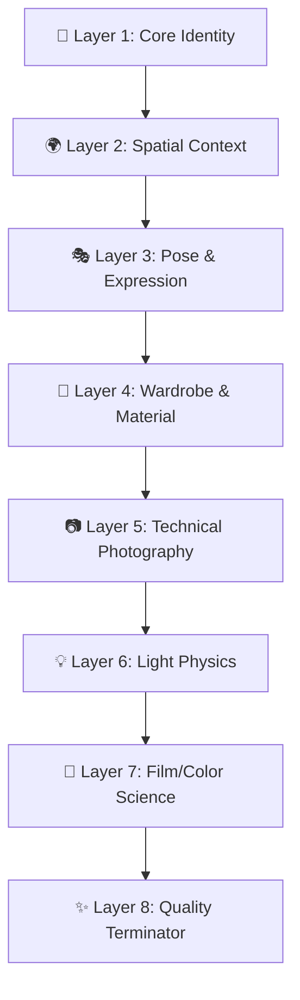

# 8-Layer Prompt Architecture — Technical Reference

> Comprehensive system for generating photorealistic & stylized AI image prompts.
> Source: `PROMPTINGGEN/gemini-api.js` (MasterPrompt System)

---

## Architecture Overview



Each layer builds on the previous one. Prompts flow as **narrative prose** (120–180 words), not bullet lists.

---

## Complete Assembled Example

> The following is a full 8-layer prompt to show how all layers merge into cohesive narrative prose.

*"A 28-year-old Southeast Asian woman with sharp cheekbones, a faint beauty mark above her lip, and deep-set almond eyes — standing on a rain-slicked Tokyo rooftop garden at blue hour, steam rising from vents below, distant city lights blurred behind her. She leans slightly forward with both hands wrapped around a ceramic mug, gaze tilted downward in quiet contemplation, lips barely parted. Wearing an oversized brushed-wool charcoal coat with notched lapels and raw-hemmed sleeves over a tucked ivory ribbed turtleneck — the fabric carrying visible weight and natural drag. Shot on Hasselblad X2D 100C, XCD 80mm f/1.9, medium format rendering. Diffused overcast daylight wrapping evenly from above, warm practical glow from a paper lantern at frame-left, cool blue ambient bouncing off wet concrete underfoot. Graded with Fuji Pro 400H tones — muted greens, pastel highlights, delicate skin warmth, fine organic grain. 8K resolution, hyperrealistic skin texture with visible pores, magazine-quality, no artifacts, no distortion."*

---

## Layer-by-Layer Breakdown

### Layer 1 — Core Identity (Anchor)

**Purpose:** Define the subject with maximum specificity — the "who/what."

**Formula:**
```
[Subject type] with [defining characteristics], [age/gender if person]
```

**Examples:**
- *"A 25-year-old Southeast Asian woman with sharp cheekbones and warm brown eyes"*
- *"A weathered male artisan in his 60s with deep laugh lines and salt-and-pepper stubble"*
- *"A sleek matte-black electric sports car with aggressive aerodynamic lines"*

**Best Practices:**
- Be ethnically specific — "Southeast Asian" > "Asian"
- Include 2–3 distinctive facial/physical features
- For non-human subjects, describe form factor + surface quality

---

### Layer 2 — Spatial Context

**Purpose:** Environment, time, atmosphere — the "where/when."

**Formula:**
```
[Located in] [specific environment], [time of day], [weather/atmosphere]
```

**Examples:**
- *"standing in a sunlit Tokyo rooftop garden during golden hour, light mist in the air"*
- *"inside a dimly lit Parisian atelier with paint-stained oak floors, late afternoon"*
- *"on a rain-slicked Manhattan crosswalk at twilight, neon reflections on wet asphalt"*

**Best Practices:**
- Name specific locations/cities for realism
- Include atmospheric elements (mist, dust, haze, rain)
- Mention floor/surface material for grounding

---

### Layer 3 — Pose & Expression Micro-Details

**Purpose:** Body language precision — the "how they exist in space."

**Formula:**
```
[Body posture], [hand placement], [gaze direction], [facial micro-expression]
```

**Examples:**
- *"leaning slightly forward with one hand resting on marble railing, looking off-camera with a subtle confident smirk"*
- *"sitting cross-legged on the floor, both hands wrapped around a ceramic mug, eyes closed in quiet contentment"*
- *"mid-stride with coat billowing behind, glancing over shoulder with a hint of mischief"*

**Best Practices:**
- Describe hands explicitly — this is the highest AI artifact risk area
- Use gaze direction to control viewer engagement
- Micro-expressions > generic emotions ("subtle knowing smile" > "happy")

> **Anti-Artifact Link:** Explicit hand description here directly counters the `❌ extra fingers / malformed hands` failure mode in Negative Constraints.

---

### Layer 4 — Wardrobe & Material Texture

**Purpose:** Fabric, fit, and material detail — the "what they're wearing/holding."

**Formula:**
```
[Garment type] made of [material] with [texture detail], [color palette], [fit/drape]
```

**Examples:**
- *"wearing a tailored cream linen blazer with visible weave texture, slightly oversized fit draping naturally over a tucked silk camisole"*
- *"in a distressed vintage leather biker jacket, warm cognac brown with patina at the elbows, worn open"*

**Best Practices:**
- Name exact materials: "brushed cotton twill" not "cotton"
- Describe colors with nuance: "warm honey brown with amber undertones" not "brown"
- Always mention fit and drape behavior
- Include construction details: "french seams", "raw hem", "mother-of-pearl buttons"

---

### Layer 5 — Technical Photography Stack

**Purpose:** Camera body, lens, and optical characteristics.

**Formula:**
```
Shot on [camera body], [lens mm] at [aperture], [focal distance/behavior]
```

**Examples:**
- *"Shot on Sony A7R V, 85mm f/1.4 GM lens, tack-sharp focus with creamy bokeh separation"*
- *"Captured on ARRI Alexa Mini LF with Cooke Anamorphic 50mm, horizontal flares"*
- *"Hasselblad X2D 100C, XCD 80mm f/1.9, medium format depth rendering"*

**Lens Selection Guide:**

| Use Case | Lens | Effect |
|----------|------|--------|
| Portrait/Beauty | 85mm f/1.2–1.4 | Compression, bokeh isolation |
| Environmental Portrait | 50mm f/1.2 | Natural perspective, context |
| Tight Crop/Detail | 135mm f/1.8 | Extreme compression, intimacy |
| Wide Scene | 24–35mm f/1.4 | Environment dominance |
| Macro/Product | 100mm f/2.8 Macro | Extreme detail |

---

### Layer 6 — Light Physics

**Purpose:** Lighting direction, quality, and physics behavior.

**Formula:**
```
[Primary light] from [direction], [quality], [secondary fill], [accent lights]
```

**Examples:**
- *"warm afternoon sunlight from camera-left at 45°, natural bounce fill from white marble floor, subtle hair light catching flyaways"*
- *"single overhead softbox with grid, deep shadows falling on the right side, silver reflector fill at 1:4 ratio"*
- *"diffused overcast daylight wrapping evenly, gentle shadows under chin, rim light from a shop window behind"*

**Lighting Vocabulary:**

| Term | Meaning |
|------|---------|
| Key light | Primary/dominant light source |
| Fill light | Secondary, reduces shadow contrast |
| Rim/Hair light | Edge separation from background |
| Practical | In-scene light source (lamp, neon) |
| Bounce | Reflected light off surfaces |
| Motivated | Light that has a visible source in scene |
| Chiaroscuro | High-contrast light/dark drama |
| Rembrandt | Triangle of light on shadow-side cheek |
| Butterfly | Direct overhead, shadow under nose |
| Split | Half face lit, half in shadow |

---

### Layer 7 — Film/Color Science

**Purpose:** Color grading, film stock emulation, tonal character.

**Formula:**
```
[Film stock/LUT], [color temperature], [tonal curve], [grain level]
```

**Examples:**
- *"graded with Kodak Vision3 500T warmth, lifted shadows with teal undertones, fine organic grain"*
- *"Fujicolor Pro 400H tones — pastel highlights, muted greens, delicate skin warmth"*
- *"crunchy cross-processed look with pushed cyans and amber shadows, heavy analog grain"*

**Common Film Stock References:**

| Film Stock | Character |
|------------|-----------|
| Kodak Portra 400 | Warm, pastel, soft skin tones |
| Kodak Vision3 500T | Cinematic warmth, slight tungsten shift |
| Fuji Pro 400H | Cool pastels, muted greens, delicate |
| Kodak Ektar 100 | Saturated, punchy, vivid colors |
| Ilford HP5+ | Classic B&W, rich midtones |
| CineStill 800T | Halation glow, tungsten cast, cinematic |

---

### Layer 8 — Quality Terminator (Closing)

**Purpose:** Final resolution, detail level, and anti-artifact directives.

**Formula:**
```
[Resolution], [detail level], [render quality], [anti-artifacts]
```

**Examples:**
- *"8K resolution, hyperrealistic skin texture with visible pores, magazine-quality, no artifacts"*
- *"4K cinematic still, film-grain texture, no digital sharpening artifacts"*
- *"ultra-high resolution print quality, razor-sharp across the frame, no deformities"*

**When to Use Which Terminator:**

| Terminator | Best For | Avoid When |
|------------|----------|------------|
| `"8K resolution, hyper-detailed, photorealistic, professional quality"` | Studio portraits, product shots, editorial | Stylized/anime prompts — may over-sharpen |
| `"magazine-quality, sharp details, no artifacts, no distortion"` | Fashion editorial, beauty close-ups | Cinematic/moody shots that need grain |
| `"masterwork, gallery print quality, no watermarks, no text"` | Fine art, landscape, large-format | Fast-turnaround e-commerce batches |
| `"4K cinematic still, film-grain texture, no digital sharpening artifacts"` | Cinematic, narrative, moody scenes | Clean commercial packshots |

---

## Before & After: Weak vs. Strong Prompt

**❌ Weak (vague, surface-level):**
> *"A beautiful Asian woman in a jacket, standing outside at night with nice lighting. High quality."*

**✅ Strong (all 8 layers applied):**
> *"A 25-year-old Southeast Asian woman with sharp cheekbones and warm brown eyes — standing on a rain-slicked Tokyo rooftop at blue hour, steam rising from street vents below. She leans against a rusted iron railing with one hand, the other tucked into her pocket, gaze cast downward in quiet thought. Wearing a distressed cognac leather biker jacket with visible stitching and elbow patina over a ribbed charcoal turtleneck, jacket worn open. Shot on Sony A7R V, 85mm f/1.4 GM, tack-sharp with creamy background separation. Warm neon glow from a signboard at camera-right, cool overcast ambient wrapping from above, faint rim light catching jacket edge. Graded with CineStill 800T — halation glow, tungsten cast, organic grain. 8K resolution, hyperrealistic, no artifacts, no distortion."*

---

## Advanced Texture Modifiers

Use these when relevant to push realism:

| Category | Modifiers |
|----------|-----------|
| **Skin** | "natural skin imperfections, subtle freckles, visible peach fuzz, realistic pores, subsurface scattering" |
| **Hair** | "individual strands catching light, natural flyaways, realistic scalp detail, wind-caught movement" |
| **Eyes** | "catchlights reflecting environment, realistic iris patterns, natural moisture, visible lash roots" |
| **Fabric** | "visible thread count, natural wrinkles at joints, realistic drape physics, weight and swing" |
| **Environment** | "depth fog, atmospheric haze, dust particles in light beams, heat distortion" |
| **Metal** | "brushed surface reflections, patina aging, micro-scratches, anisotropic highlights" |
| **Glass/Liquid** | "caustic light patterns, meniscus curvature, condensation droplets, refraction distortion" |

---

## Style Presets (Camera/Lens/Film)

### Maximum (Photorealistic)
- **Camera:** Canon EOS R5 / Sony A7R V
- **Lens:** 85mm f/1.2 (portrait) · 50mm f/1.2 (environmental) · 135mm f/1.8 (tight crop)
- **Quality:** "photorealistic, ultra detailed, sharp focus, 8K resolution"

### Cinematic
- **Camera:** ARRI Alexa Mini LF / ARRI Alexa 35
- **Lens:** Cooke Anamorphic 50mm · 75mm (close-up) · Atlas Mercury 40mm (wide)
- **Film:** "subtle film grain, 2.39:1 widescreen, cinematic color grading"

### Editorial
- **Camera:** Hasselblad X2D 100C / Phase One IQ4
- **Lens:** XCD 80mm f/1.9 (portrait) · XCD 55mm f/2.5 (full body) · Fujinon GF 110mm f/2
- **Style:** "high fashion editorial, Vogue magazine quality, clean whites"

### Anime
- **Camera:** N/A (illustrated)
- **Framing:** cinematic language — "wide establishing shot", "dramatic low-angle close-up"
- **Style:** "anime art style, cel shading, vibrant saturated colors, Studio Ghibli / Makoto Shinkai"

### Game Art
- **Camera:** Virtual (Unreal Engine 5)
- **Framing:** "third-person over-shoulder 70mm", "first-person wide 24mm"
- **Engine:** "Unreal Engine 5, ray tracing, photorealistic CGI, subsurface scattering, Lumen GI"

### Fantasy
- **Camera:** Canon EOS R5 / Sony A7R V
- **Lens:** 85mm f/1.4 (ethereal) · 35mm f/1.4 (landscape) · 105mm f/1.4 (magical close-up)
- **Effects:** "magical atmosphere, glowing particles, ethereal rim lighting, mystical fog"

### Moody
- **Camera:** Leica Q3 / Leica M11
- **Lens:** Summilux 50mm f/1.4 (noir) · 28mm f/2 (environmental) · 85mm f/1.4 (intimate)
- **Lighting:** "low-key dramatic, noir shadows, high contrast, chiaroscuro"

### Vintage
- **Camera:** Nikon FM2 / Fujifilm X-T5
- **Lens:** Helios 44-2 58mm f/2 (swirly bokeh) · Canon FD 50mm f/1.4 · Petzval 85mm f/2.2
- **Film:** "Kodak Portra 400, organic film grain, faded blacks, 1970s palette"

---

## 📸 Camera + Lens Encyclopedia

Expanded reference beyond the style presets — organized by shooting discipline.

### 👗 Fashion Photography

Fashion photography has distinct sub-genres, each with different gear and aesthetic requirements.

#### High Fashion Editorial (Vogue, Harper's Bazaar)

| Camera | Lens | Signature |
|--------|------|-----------|
| Hasselblad X2D 100C | XCD 80mm f/1.9 | Medium format depth, skin luxury, magazine cover quality |
| Phase One IQ4 150MP | Schneider LS 110mm f/2.8 | Maximum resolution, billboard-ready detail |
| Canon R5 | RF 85mm f/1.2L DS | Defocus Smoothing for buttery fashion bokeh |
| Sony A1 | FE 135mm f/1.8 GM | Tight crop beauty, extreme subject isolation |

**Lighting:** *"Large octabox key at 45° camera-right, white V-flat fill, beauty dish overhead for contouring, gray seamless backdrop"*
**Style Keywords:** *"high fashion editorial, Vogue Italia, Steven Meisel-inspired, dramatic pose, couture garment detail"*

#### Lookbook / E-commerce

| Camera | Lens | Signature |
|--------|------|-----------|
| Canon R6 III | RF 50mm f/1.2L | Natural perspective, consistent color, great for batch shooting |
| Sony A7 IV | FE 85mm f/1.8 | Sharp + affordable, reliable AF for high-volume |
| Nikon Z8 | Nikkor Z 50mm f/1.8 S | Clean, neutral rendering across hundreds of shots |
| Fujifilm X-T5 | XF 35mm f/1.4 R | Full body on APS-C, classic rendering |

**Lighting:** *"Two strip softboxes at 45° from both sides, large scrim overhead for even spread, white cyclorama background"*
**Style Keywords:** *"clean, consistent, e-commerce white background, natural skin tones, garment detail sharp"*

#### Runway / Catwalk

| Camera | Lens | Signature |
|--------|------|-----------|
| Sony A9 III | FE 70-200mm f/2.8 GM II | Global shutter — zero distortion on walking models |
| Canon R3 | RF 70-200mm f/2.8L IS | Fastest AF tracking, eye-detect through sunglasses |
| Nikon Z9 | Z 70-200mm f/2.8 VR S | Silent shutter, rapid burst for catwalk moments |
| Sony A1 | FE 135mm f/1.8 GM | Tight crop from end of runway, blurred audience |

**Lighting:** *"venue ambient + overhead runway spots, mixed color temperature, fast shutter to freeze mid-stride"*
**Style Keywords:** *"runway photography, Milan Fashion Week, motion freeze, designer garment, editorial crop"*

#### Beauty / Close-up

| Camera | Lens | Signature |
|--------|------|-----------|
| Canon R5 | RF 100mm f/2.8L Macro IS | Skin texture, lip detail, eyelash-level sharpness |
| Hasselblad X2D | XCD 120mm f/3.5 Macro | Medium format beauty, extreme skin detail |
| Sony A7R V | FE 90mm f/2.8 Macro G | 61MP skin resolution, dermatology-level detail |
| Nikon Z8 | Nikkor Z MC 105mm f/2.8 VR S | Macro beauty, micro-detail on makeup textures |

**Lighting:** *"ring light for catch-light halo in eyes, beauty dish at 0° overhead, clamshell setup with silver reflector chin fill"*
**Style Keywords:** *"beauty photography, skin texture, makeup editorial, dewy skin, visible pores, lash detail"*

#### Street Style / Fashion Candid

| Camera | Lens | Signature |
|--------|------|-----------|
| Fujifilm X100V | Fixed 23mm f/2 (35mm equiv.) | Film simulation, compact, candid snap |
| Leica Q3 | Summilux 28mm f/1.7 | Street luxury, rich tonality, fast snap focus |
| Sony A7C II | FE 35mm f/1.4 GM | Compact full-frame, fast AF, street versatile |
| Ricoh GR IIIx | Fixed 26.1mm f/2.8 (40mm equiv.) | Pocket-sized, snap focus, documentary style |

**Lighting:** *"available light only, reflections off glass storefronts, dappled shade, golden hour side-light on pavement"*
**Style Keywords:** *"street style, OOTD, candid fashion, urban backdrop, natural light, fashion week outside venue"*

#### Flat Lay / Fashion Product

| Camera | Lens | Signature |
|--------|------|-----------|
| Canon R5 | TS-E 90mm f/2.8L Macro (Tilt-Shift) | Selective focus plane across flat arrangement |
| Sony A7R V | FE 50mm f/1.2 GM | Overhead perspective, shallow DOF flat lay |
| Canon R5 | RF 35mm f/1.4L | Wide overhead, full outfit layout |
| Phase One XF IQ4 | Schneider LS 80mm f/2.8 | Ultra resolution product flat lay |

**Lighting:** *"large diffused panel directly overhead, edge-lit for fabric texture, white bounce cards at sides for fill"*
**Style Keywords:** *"flat lay, knolling, fashion product, wardrobe layout, editorial arrangement, texture focus"*

### Portrait Specialists

| Camera | Lens | Signature Effect |
|--------|------|------------------|
| Canon R5 | RF 85mm f/1.2L DS | Defocus Smoothing — ultra-silky bokeh rendering |
| Nikon Z9 | Nikkor Z 85mm f/1.2 S | Razor sharp + 3D pop, clinical rendering |
| Sony A1 | FE 135mm f/1.8 GM | Extreme compression, melted backgrounds |
| Fujifilm X-T5 | XF 56mm f/1.2 R WR | Film simulation character + classic rendering |
| Canon R6 III | RF 50mm f/1.2L | Natural perspective, environmental portraits |
| Sony A7C II | FE 85mm f/1.4 GM | Compact body, pro-grade bokeh |

### Medium Format (Ultra Resolution)

| Camera | Lens | Signature |
|--------|------|-----------|
| Fujifilm GFX 100S II | GF 80mm f/1.7 R WR | Extreme resolution + shallow DOF, medium format quality |
| Pentax 645Z | FA 77mm f/1.8 Limited | Vintage medium format rendering, organic tones |
| Phase One XF IQ4 150MP | Schneider LS 80mm f/2.8 | Maximum resolving power — 150 megapixels |
| Hasselblad X2D | XCD 30mm f/3.5 | Ultra-wide medium format, architecture + landscape |
| Fujifilm GFX 50S II | GF 110mm f/2 R LM WR | Portrait telephoto, medium format compression |

### Cinema Cameras (Beyond ARRI)

| Camera | Lens | Signature |
|--------|------|-----------|
| RED V-Raptor XL | Zeiss Supreme Prime 50mm T1.5 | Clean + clinical cinema, 8K global shutter |
| Sony Venice 2 | Panavision Primo 75mm | Hollywood color science, dual-base ISO |
| Blackmagic URSA Mini Pro 12K | Sigma Cine 35mm T1.5 FF | Raw cinematic, indie film aesthetic |
| Canon C70 | CN-E 85mm T1.3 | Canon skin tone magic, RF mount |
| RED Komodo-X | Cooke S7/i 65mm T2.0 | Cooke Look™ — warm, gentle, flattering |
| Sony FX6 | Zeiss Batis 40mm f/2 CF | Documentary/run-and-gun versatility |

### Action/Sport

| Camera | Lens | Use |
|--------|------|-----|
| Sony A9 III | FE 70-200mm f/2.8 GM II | Freeze motion, global shutter — zero rolling shutter |
| Canon R3 | RF 400mm f/2.8L IS | Extreme subject isolation, sports compression |
| Nikon Z9 | Z 100-400mm f/4.5-5.6 VR S | Wildlife, motorsports, long-range candid |
| Canon R7 | RF 100-500mm f/4.5-7.1L | APS-C reach advantage, 800mm equivalent |
| Sony A1 | FE 600mm f/4 GM + 1.4x TC | Birding, safari — ultimate reach |

### Macro/Extreme Detail

| Camera | Lens | Use |
|--------|------|-----|
| Canon R5 | RF 100mm f/2.8L Macro IS | Focus breathing control, 1.4x magnification |
| Sony A7R V | FE 90mm f/2.8 Macro G | Product detail, jewelry, texture studies |
| Any body | Laowa 100mm f/2.8 2x Ultra Macro | Beyond 1:1 — extreme close-up, insect detail |
| Canon R5 | MP-E 65mm f/2.8 1-5x Macro | Up to 5x magnification — laboratory-level detail |
| Any body | Laowa 24mm f/14 Probe | "Bug's eye view" — deep elongated barrel, waterproof tip |

### Character/Artistic Lenses

Specialty lenses that create unique optical effects — not clinically perfect, but full of personality.

| Lens | Effect | Best For |
|------|--------|----------|
| Meyer-Optik Trioplan 100mm f/2.8 | **Soap bubble bokeh** — circular bokeh highlights | Dreamy portraits, fairy-tale scenes |
| Lensbaby Velvet 85mm f/1.8 | **Ethereal glow** wide open, sharp stopped down | Fantasy, beauty, soft-focus dream |
| Canon Dream Lens 50mm f/0.95 | Extreme shallow DOF, vintage rendering | Moody, artistic portraits |
| Petzval 58mm f/1.9 (Lomography) | **Swirly bokeh** + sharp center | Vintage character, artistic editorial |
| Helios 40-2 85mm f/1.5 | Russian lens, **aggressive bokeh swirl** | Budget character, retro portraits |
| Helios 44-2 58mm f/2 | Subtle swirl, warm vintage rendering | Classic vintage look, affordable |
| Zeiss Otus 55mm f/1.4 | Clinical sharpness + extreme 3D pop | "Perfect" rendering, no compromise |
| Nikon 58mm f/0.95 S Noct | Nikon's fastest — magical night rendering | Low-light, star fields, night portraits |
| Canon FD 55mm f/1.2 SSC | Vintage glow wide open, sharp stopped down | Retro color rendition, film nostalgia |
| Rokinon/Samyang 85mm f/1.4 | Budget cream bokeh, punchy colors | Affordable portrait look |

### Architecture/Specialty

| Camera/Setup | Lens | Use |
|--------------|------|-----|
| Canon R5 | TS-E 17mm f/4L (Tilt-Shift) | Architecture — perspective correction, no converging lines |
| Canon R5 | TS-E 24mm f/3.5L II (Tilt-Shift) | Interior design, real estate, selective focus plane |
| Sony A7R V | FE 14mm f/1.8 GM | Astrophotography, ultra-wide interiors, night sky |
| Large Format (Sinar P3) | Schneider 150mm f/5.6 | Extreme detail, tilt/swing focus, view camera |
| Large Format (Linhof Technika) | Rodenstock 180mm f/5.6 | Fine art landscape, infinite sharpness |
| IR-converted camera | Any lens | Infrared aesthetic — white foliage, dark skies |
| Pinhole camera | No lens (pinhole) | Infinite DOF, dreamlike softness, long exposure |
| Fujifilm X100V | Fixed 23mm f/2 (35mm equiv.) | Street photography, compact candid, film simulations |
| Ricoh GR IIIx | Fixed 26.1mm f/2.8 (40mm equiv.) | Pocket street camera, snap focus, documentary |
| DJI Mavic 3 Cine | Hasselblad 24mm equiv. f/2.8 | Aerial/drone, bird's eye perspective, landscape |

---

## Grid Layout System

> Use for brand moodboards, lookbooks, multi-shot campaigns, or any multi-cell composition.

For multi-cell compositions (2×2, 3×3), each cell must have a **unique combination** of:

| Dimension | Variations |
|-----------|-----------|
| **Pose** | standing, sitting, walking, leaning, turning, crouching, mid-stride, looking over shoulder |
| **Camera Angle** | eye-level, low angle (hero), high angle (vulnerability), dutch angle, bird's eye, worm's eye, 3/4 |
| **Framing** | ECU, CU, MCU, MS, MFS, FS, WS |
| **Lens** | wide (24–35mm) for WS/FS, standard (50mm) for MS, telephoto (85–135mm) for CU/ECU |

**Rules:**
- Never repeat pose + angle + framing in two cells
- Keep identity, wardrobe, and lighting consistent across cells
- Label cells: "Top-left:", "Top-right:", etc. (2×2) or "Row N Left/Center/Right" (3×3)

---

## Negative Constraints (Always Avoid)

These constraints are your **failure-mode checklist**. Where relevant, the layer that prevents each failure is noted.

```
❌ Cropped limbs, distorted faces, extra fingers, malformed hands  → Counter with Layer 3: explicit hand description
❌ Watermarks, text overlays, logos, signatures                    → Counter with Layer 8: "no watermarks, no text"
❌ Low quality, blurry, pixelated, JPEG artifacts                  → Counter with Layer 8: resolution + quality terminator
❌ Unnatural poses, anatomical impossibilities                     → Counter with Layer 3: precise posture formula
❌ Duplicate subjects, fused body parts                           → Counter with Layer 1: singular subject anchor
```

---

## Identity Preservation Anchor

When using a reference image, prepend:

```
"Preserving the exact facial features, skin tone, bone structure, 
and distinctive characteristics of the reference subject..."
```

---

## 🎬 World-Class Fashion Director — Pose & Styling Master Reference

> This section transforms the AI Director from a generic assistant into a **world-class fashion photographer/creative director** — inspired by the pose direction of Steven Meisel, the lighting drama of Peter Lindbergh, and the narrative framing of Annie Leibovitz.

### Core Philosophy: "Directed, Not Described"

❌ **Generic (pool-picked):** `"standing tall and confident, shoulders back, one hand on hip"`
✅ **Directed (world-class):** `"weight shifted onto left foot with right knee softly bent, left hand loosely gripping the strap of a leather bag slung over shoulder, head tilted 15° toward camera-right, chin slightly dropped, eyes locked on lens through lowered lashes — a quiet power move"`

The difference: **every joint, every finger, every gaze angle is intentional**. A real director tells you where your pinky goes.

---

### Pose Direction Formula (Layer 3 — Advanced)

```
[Weight distribution] + [Spine line] + [Shoulder angle] + 
[Left hand exact placement] + [Right hand exact placement] + 
[Head tilt + chin angle] + [Gaze vector] + [Micro-expression] + 
[Relationship to environment/prop]
```

#### 30 Elite Pose Directions (Non-Generic)

**Standing — Power & Confidence:**
1. *"Weight on back foot, front foot pointed 45° toward camera, left hand resting on collarbone with fingers slightly spread, right arm hanging naturally with gentle fist, chin level, direct unwavering stare through the lens"*
2. *"Contra-posto stance, hips shifted left, right hand tucked into waistband at the side, left arm hanging with fingers lightly touching the thigh, head turned 30° right, eyes following camera, jaw relaxed with lips barely parted"*
3. *"Standing square to camera, feet shoulder-width, both arms hanging at sides with palms facing forward (vulnerability pose), chin lifted 10°, soft defiant gaze, no smile"*

**Standing — Editorial & High Fashion:**
4. *"Body turned three-quarters away, looking back over right shoulder, left hand pushing hair behind ear with wrist visible, right arm pressing against hip, spine in a dramatic S-curve, one eyebrow imperceptibly raised"*
5. *"Full body facing camera, arms crossed at wrist level (not chest), elbows slightly out creating angular negative space, weight on left foot, head perfectly straight, expression blank — magazine-cover neutral"*
6. *"Mid-stride freeze-frame, left leg forward with heel about to strike ground, right arm swinging naturally forward, coat/jacket caught in manufactured wind, looking straight ahead past camera — not at it"*

**Leaning & Environmental Interaction:**
7. *"Leaning back against textured wall with only shoulder blades touching, feet planted 30cm from wall, arms crossed low at waist, head tilted toward the light source, eyes half-closed, serene indifference"*
8. *"One forearm resting on a railing at chest height, other hand holding the railing below, body weight forward creating a natural lean, face in profile with just the bridge of nose catching light, contemplative exhale"*
9. *"Leaning into a doorframe, left shoulder pressed against it, right hand reaching up to grip the frame overhead, body creating a visible diagonal line, looking down at feet with a private smile"*

**Sitting — Dynamic & Narrative:**
10. *"Sitting on the edge of a surface, thighs parallel, feet dangling, both hands gripping the edge beside hips, shoulders hunched forward slightly, looking up at camera from below — a caught-off-guard candid moment"*
11. *"Cross-legged on the floor, spine perfectly straight (yoga-like poise), both hands resting on knees palms-down, eyes closed, face tilted 10° upward into overhead light — meditative calm"*
12. *"Sitting sideways on a chair, one arm draped over the backrest, other hand holding a ceramic mug near the face (not drinking — just holding for warmth), kicking one leg up, casual intimate moment"*

**Movement & Action:**
13. *"Caught mid-turn, body rotating clockwise, hair whipping in motion blur at ends, right hand reaching back to catch falling scarf, left foot pivoting, expression of spontaneous laughter — a real moment frozen"*
14. *"Walking toward camera with purpose, both arms swinging naturally, coat flaring behind, step length exaggerated for drama, dead-serious eye contact, jaw set, fashion runway energy"*
15. *"Bending forward slightly to adjust shoe/heel strap, one hand on knee for balance, other hand at ankle, face looking sideways into camera with an amused 'you caught me' expression"*

**Close-Up & Beauty:**
16. *"Face filling 70% of frame, chin resting on stacked fists, elbows on a surface, eyes enormous and directly into lens, one eyebrow raised questioningly, light catching the cheekbone and inner corner of eye"*
17. *"Profile view, nose and forehead creating clean silhouette against backlight, jaw tilted up, lips slightly parted showing teeth edge, one hand barely visible at neck — adjusting a necklace clasp"*
18. *"Hands framing the face (not touching), palms facing camera on either side of cheeks, fingers spread naturally, eyes peering through the gap between fingers — playful editorial"*

**Duo with Product:**
19. *"Holding product at chest height with both hands, thumbs on top, turning it slightly toward camera light to catch surface sheen, looking down at the product (not camera) with genuine fascination"*
20. *"Product tucked under arm casually like a book, other hand in pocket, walking past camera — product is secondary, lifestyle is primary, effortless endorsement"*
21. *"Sitting at table, product placed in front, both hands wrapped around it like a warm drink, leaning forward over the table, elbows on surface, intimate conversation-with-viewer framing"*

**Low Angle & Dramatic:**
22. *"Shot from below waist height — subject standing with feet apart, hands on hips, chin down but eyes looking dead into the low camera, dramatic power angle, ceiling/sky visible behind head"*
23. *"Kneeling on one knee, arms resting on the raised knee, body leaned forward, face level with the low camera — intimate and commanding simultaneously, shallow depth of field melting background"*

**Candid & Lifestyle:**
24. *"Caught looking out a rain-streaked window, one hand flat against the glass, fingers leaving fog prints, body weight against the window frame, reflection visible, expression far-away and wistful"*
25. *"Laughing genuinely with head thrown back, both hands clapping together at chest height, eyes squeezed shut, teeth showing, body slightly bent forward at the waist — pure joy snapshot"*
26. *"Lying on a couch/bed on stomach, feet kicked up behind (ankles crossed), chin propped on one hand, scrolling a phone held in the other, completely absorbed — voyeuristic candid"*

**Architectural & Wide:**
27. *"Standing at the far end of a long corridor/hallway, tiny in frame, arms at sides, facing the camera head-on — isolation, scale contrast, the subject is the breathing point of the composition"*
28. *"Sitting on steps in front of grand architecture, legs stretched down the stairs at an angle, leaning back on palms, face tilted up toward sun, eyes closed — basking, serene"*
29. *"Framed through a window/doorway from outside, subject inside performing a daily ritual (pouring water, arranging flowers), unaware of camera, voyeuristic lifestyle editorial"*

**Experimental & Avant-Garde:**
30. *"Body contorted into an angular shape — one leg extended, arms at sharp geometric angles, head tilted perpendicular to shoulders, creating a human sculpture against a minimal backdrop, casting dramatic shadow geometry on the wall behind"*

---

### Framing-to-Lens Intelligence Matrix

When the director picks a framing, the lens MUST match:

| Framing | Abbreviation | Lens Range | Aperture | Effect |
|---------|-------------|------------|----------|--------|
| Extreme Wide Shot | EWS | 16–24mm | f/4–5.6 | Subject tiny, environment dominates |
| Wide Shot | WS | 24–35mm | f/2.8–4 | Full body + environment context |
| Full Shot | FS | 35–50mm | f/2–2.8 | Head-to-toe, minimal distortion |
| Medium Full Shot | MFS | 50mm | f/1.8–2.8 | Knees-up, natural perspective |
| Medium Shot | MS | 50–85mm | f/1.4–2.8 | Waist-up, editorial standard |
| Medium Close-Up | MCU | 85mm | f/1.4–1.8 | Chest-up, intimate |
| Close-Up | CU | 85–135mm | f/1.2–1.8 | Face + shoulders, compression |
| Extreme Close-Up | ECU | 100–135mm | f/1.8–2.8 | Eyes/lips only, macro detail |

---

### Multi-Shot Variation Rules (Batch Direction)

When directing a batch of N shots, the director MUST follow these rules:

**LOCK (same across all shots):**
- Identity anchor (Layer 1) — always `"The same person as shown in the reference image"`
- Wardrobe (Layer 4) — exact same clothing description
- Film/Color Science (Layer 7) — same film stock and grading
- Quality Terminator (Layer 8) — same resolution and quality
- Overall vibe/mood

**VARY (different in every shot):**
- Pose (Layer 3) — unique body position, hand placement, interaction
- Camera angle — no two shots from the same angle (mix eye-level, low, high, three-quarter, profile)
- Lens focal length — match to framing (50mm for wide, 85mm for medium, 135mm for close-up)
- Framing — guaranteed distribution: WS + MS + CU minimum for 3+ shots
- Lighting direction — key light from different angles
- Setting micro-details — same location, different corner/angle/time

**Guaranteed Framing Distribution:**

| Batch Size | Required Framings |
|------------|-------------------|
| 1 shot | Medium Shot |
| 2 shots | Wide + Close-Up |
| 3 shots | Wide + Medium + Close-Up |
| 4 shots | Wide + Medium + Close-Up + Full Body |
| 5+ shots | WS + MS + CU + FB + additional from pool |

---

### Styling Archetypes (Vibe → Full Technical Stack)

| Vibe | Camera Body | Film Stock | Lighting Character | Pose Energy |
|------|-------------|------------|-------------------|-------------|
| `casual` | iPhone 15 Pro | Kodak Gold 200 | Warm, natural, available light | Relaxed, candid, lifestyle |
| `editorial` | Mamiya RZ67 | Kodak Portra 160 | Precise, sculpted, controlled | Angular, deliberate, magazine |
| `bold` | Phase One IQ4 | Ilford HP5 push-processed | Extreme contrast, dramatic | Confrontational, powerful |
| `dreamy` | Contax 645 | Fuji Pro 400H | Soft, diffused, ethereal | Flowing, weightless, gentle |
| `moody` | Leica M11 | CineStill 800T | Low-key, noir, atmospheric | Contemplative, withdrawn |
| `premium` | Hasselblad X2D | Digital neutral | Clinical, even, flawless | Composed, minimal, restrained |
| `energetic` | Sony A7IV | Kodak Ektar 100 | Bright, dynamic, vivid | Dynamic, explosive, joyful |

---

### Anti-Generic Pose Checklist

Before finalizing any pose direction, verify:

- [ ] Are **both hands explicitly described** with finger positions?
- [ ] Is the **weight distribution** specified (which foot carries weight)?
- [ ] Is the **gaze vector** precise (not just "looking at camera" but "eyes locked through lowered lashes")?
- [ ] Is there a **micro-expression** (not "happy" but "left corner of mouth lifted in knowing amusement")?
- [ ] Does the pose have a **narrative reason** (not posing for a photo, but caught in a moment)?
- [ ] Is the **spine line** described (S-curve, ramrod straight, casual slouch)?
- [ ] Is there **interaction with environment or prop** (leaning, touching, holding)?

> The following layers and features are under consideration and have not been integrated into the core system.

### Layer 9 — Emotion & Narrative Mood
A dedicated layer for the **emotional tone** of the entire scene, separate from facial expression.

```
[Emotional atmosphere], [narrative tension], [viewer feeling]
```
- *"an atmosphere of quiet melancholy, the stillness before departure, invoking nostalgia"*
- *"electric anticipation, the moment before something extraordinary, viewer feels pulled in"*

### Layer 10 — Post-Processing & VFX
Explicit control over digital post-processing effects.

```
[Lens effects], [compositing], [digital grade]
```
- *"subtle chromatic aberration at edges, lens flare from backlight, gentle vignette"*
- *"motion blur on background suggesting movement, tilt-shift miniature effect"*
- *"double exposure overlay with city skyline, glitch art distortion bands"*

---

### New Style Presets `[DRAFT]`

| Preset | Camera/Lens | Signature |
|--------|-------------|-----------|
| **Product/Packshot** | Phase One XT + 120mm Macro · Canon TS-E 90mm (tilt-shift) | Clean white/gradient BG, focus stacking |
| **Food Photography** | Canon R5 + 100mm f/2.8L Macro · 50mm overhead rig | Steam particles, sauce drip freeze, warm tungsten |
| **Architecture** | Canon TS-E 24mm f/3.5L · Sony 16-35mm f/2.8 GM | Perspective correction, blue hour, interior glow |
| **Street/Documentary** | Leica M11 + 35mm Summicron · Fujifilm X100V | Candid, available light, grain, decisive moment |
| **Underwater** | Nikon Z8 + Nauticam housing · 8-15mm fisheye | Caustic light rays, color absorption shift, bubbles |
| **Aerial/Drone** | DJI Mavic 3 Cine · Hasselblad 24mm | Bird's eye, landscape scale, golden hour gradient |
| **Noir/Mystery** | Leica M Monochrom + 50mm Noctilux f/0.95 | Pure B&W, extreme contrast, venetian blind shadows |
| **Retro-Futurism** | Virtual camera | Synthwave colors, chrome reflections, neon grid, 80s sci-fi |

---

### Advanced Features `[DRAFT]`

#### 🎯 Aspect Ratio Intelligence
Auto-suggest aspect ratios based on use case:

| Use Case | Ratio | Pixels |
|----------|-------|--------|
| Instagram Portrait | 4:5 | 1080×1350 |
| Instagram Square | 1:1 | 1080×1080 |
| Instagram Story / Reel | 9:16 | 1080×1920 |
| Cinematic Wide | 2.39:1 | 2560×1071 |
| YouTube Thumbnail | 16:9 | 1280×720 |
| Pinterest Pin | 2:3 | 1000×1500 |
| Print A4 Portrait | 1:1.414 | 2480×3508 |
| Ultrawide Banner | 3:1 | 3000×1000 |

#### 🧑‍🤝‍🧑 Multi-Subject Composition Rules
When the scene has 2+ subjects:
- Define spatial relationship ("standing face-to-face", "one sitting, one leaning over")
- Assign focus hierarchy (primary subject sharp, secondary at f/2.8 depth)
- Describe interaction ("making eye contact", "passing an object", "unaware of each other")

#### 🏷️ Brand Consistency Layer
For commercial/brand work:
- Brand color palette injection (hex → descriptive color mapping)
- Mood board reference vocabulary
- Product placement guidelines (angle, prominence, logo visibility)
- Typography zone reservation ("leave negative space upper-right for headline")

#### 🎬 Motion/Video Prompt Extension
For video generation models (Runway, Kling, Veo):
- Camera movement: "slow dolly in", "orbiting 180°", "crane up reveal"
- Subject motion: "hair flowing in wind", "fabric caught mid-twirl"
- Temporal cues: "starts tight on eyes, pulls back to reveal full scene"
- Duration mapping: 4s / 8s / 16s generation targets

#### 🌤️ Environmental Modifiers Library

| Category | Options |
|----------|---------|
| **Weather** | clear sky, overcast, light rain, heavy downpour, snow falling, fog, haze, sandstorm |
| **Time** | blue hour, golden hour, harsh noon, twilight, midnight, pre-dawn |
| **Season** | spring cherry blossoms, summer heat haze, autumn falling leaves, winter frost |
| **Urban** | neon-lit, steam from vents, wet cobblestone, graffiti walls, construction scaffolding |
| **Nature** | dappled forest light, ocean spray, desert mirages, mountain mist, wildflower meadow |

#### 🎨 Color Palette Presets

| Palette | Colors | Mood |
|---------|--------|------|
| **Earth Tones** | terracotta, olive, sand, burnt sienna | Warm, organic, grounded |
| **Nordic Minimal** | off-white, pale grey, muted blue, birch | Clean, calm, sophisticated |
| **Neon Cyberpunk** | electric magenta, cyan, deep purple, lime | Futuristic, energetic |
| **Old Money** | navy, cream, forest green, burgundy, gold | Luxury, heritage, refined |
| **Pastel Dream** | lavender, baby pink, mint, soft peach | Gentle, feminine, ethereal |
| **Desert Sunset** | coral, amber, dusty rose, deep indigo | Warm, dramatic, romantic |

#### 🔄 Prompt Chaining (Multi-Shot Sequences)
For consistent multi-image series:
- **Identity Lock:** same subject description across all prompts
- **Wardrobe Continuity:** same outfit, different angles/contexts
- **Narrative Progression:** scene 1 → scene 2 → scene 3 with story arc
- **Color Consistency:** same grade/film stock across all shots

---

## Output Rules

| Rule | Detail |
|------|--------|
| Language | English only — no other languages in any field |
| Length | 120–180 words per prompt |
| Format | Narrative prose, flowing through all 8 layers |
| Principle | "Show, don't tell" — describe light behavior, not "beautiful lighting" |
| Closing | Always end with quality terminators (see Layer 8 guide) |

---

*Last updated: 2026-03-18*
